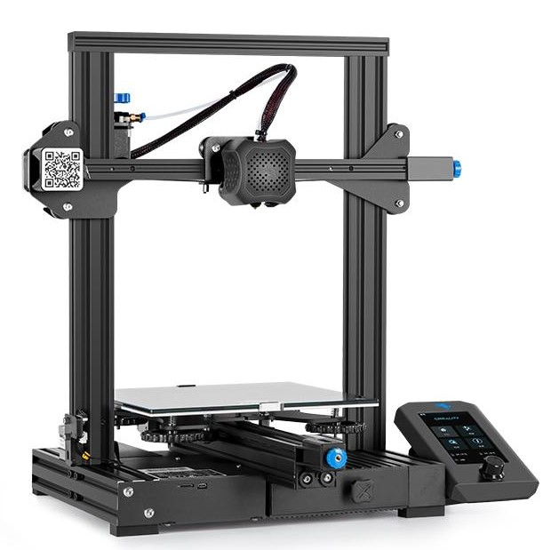

# Firmware for the Creality Ender 3 V2 Printer

##  RET6 Ender 3 V2 Edition

Forked from [@mriscoc](https://github.com/mriscoc/Ender3V2S1) professional firmware.

## Credits

This is a Marlin based firmware and is maintained by [@mkxwell](https://github.com/mkxwell)  

Marlin firmware is an Open Source project hosted on Github, [Marlin](https://marlinfw.org/) is owned and maintained by the maker community.  

## Disclaimer  

THIS FIRMWARE AND ALL OTHER FILES IN THE DOWNLOAD ARE PROVIDED FREE OF CHARGE WITH NO WARRANTY OR GUARANTEE. SUPPORT IS NOT INCLUDED JUST BECAUSE YOU DOWNLOADED THE FIRMWARE. WE ARE NOT LIABLE FOR ANY DAMAGE TO YOUR PRINTER, PERSON, OR ANY OTHER PROPERTY DUE TO USE OF THIS FIRMWARE. IF YOU DO NOT AGREE TO THESE TERMS THEN DO NOT USE THE FIRMWARE.

## LICENSE
For the license, check the header of each file, if the license is not specified there, the project license will be used. Marlin is licensed under the GPL.
